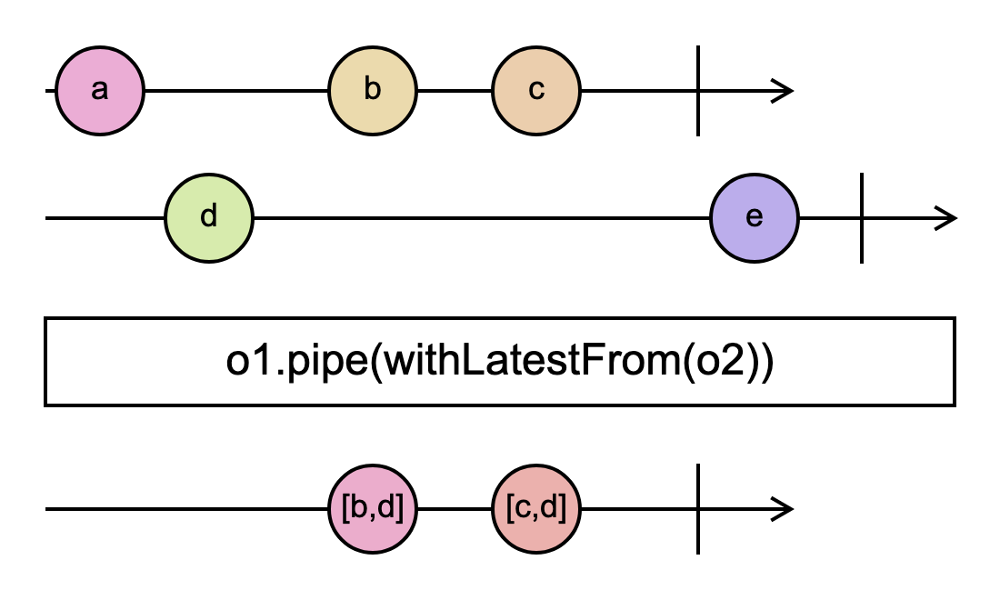
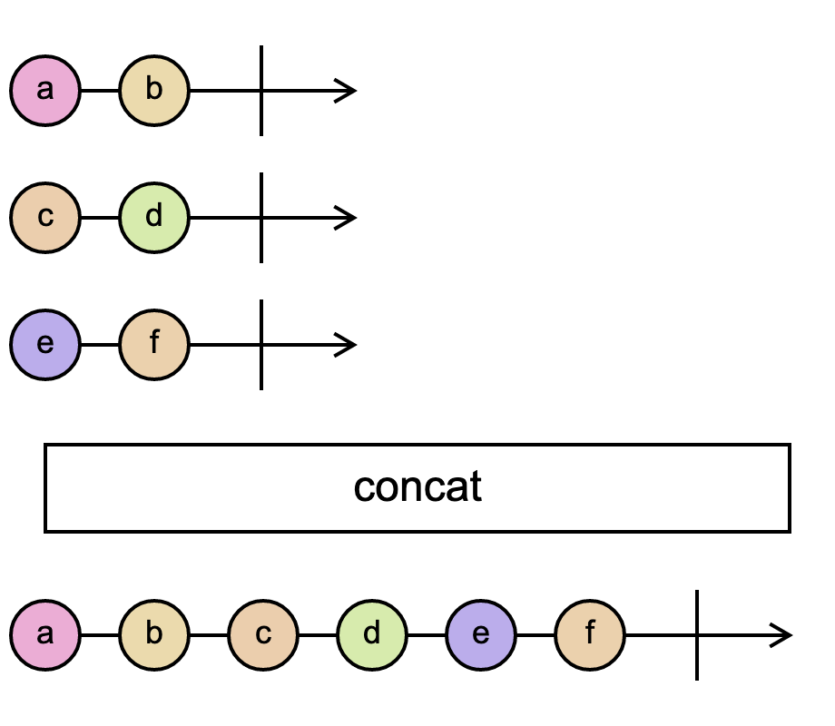

<h1 align="center">RxJS notes</h1>

A collection of my RxJS notes, diagrams, and code examples.

All examples and diagrams are my own. Feel free to use them for any purpose.

# Table of contents

- [Classes](#classes)
  * [`Observable`](#observable)
  * [`Subject`](#subject)
  * [`BehaviorSubject`](#behaviorsubject)
  * [`ReplaySubject`](#replaysubject)
- [Combination operators](#combination-operators)
  * [`combineLatestWith`](#combinelatestwith)
  * [`withLatestFrom`](#withlatestfrom)
  * [`merge`](#merge)
  * [`concat`](#concat)
  * [`concatAll`](#concatall)
  * [`switchAll`](#switchall)
  * [`pairwise`](#pairwise)
- [Transformation operators](#transformation-operators)
  * [`map`](#map)
  * [`scan`](#scan)
  * [`reduce`](#reduce)
  * [`mergeMap`](#mergemap)
  * [`concatMap`](#concatmap)
  * [`switchMap`](#switchmap)
  * [`partition`](#partition)
- [Filtering operators](#filtering-operators)
  * [`filter`](#filter)
  * [`take`](#take)
  * [`debounceTime`](#debouncetime)
  * [`throttleTime`](#throttletime)
  * [`last`](#last)
  * [`distinct`](#distinct)
  * [`distinctUntilChanged`](#distinctuntilchanged)
  * [`sample`](#sample)
- [Multicasting](#multicasting)
  * [`connectable`](#connectable)
  * [`share`](#share)
- [Utils](#utils)
  * [`repeat`](#repeat)

# Notes Overview

## Classes

### `Observable`

[Go to note folder](./notes/Observable/)

### `Subject`

[Go to note folder](./notes/Subject/)

### `BehaviorSubject`

[Go to note folder](./notes/BehaviorSubject/)

### `ReplaySubject`

[Go to note folder](./notes/ReplaySubject/)

## Combination operators

### `combineLatestWith`

[Go to note folder](./notes/combineLatestWith/)

### `withLatestFrom`

[Go to note folder](./notes/withLatestFrom/)

### `merge`

[Go to note folder](./notes/merge/)

### `concat`

[Go to note folder](./notes/concat/)

### `concatAll`

[Go to note folder](./notes/concatAll/)

### `switchAll`

[Go to note folder](./notes/switchAll/)

### `pairwise`

[Go to note folder](./notes/pairwise/)

## Transformation operators

### `map`

[Go to note folder](./notes/map/)

### `scan`

[Go to note folder](./notes/scan/)

### `reduce`

[Go to note folder](./notes/reduce/)

### `mergeMap`

[Go to note folder](./notes/mergeMap/)

### `concatMap`

[Go to note folder](./notes/concatMap/)

### `switchMap`

[Go to note folder](./notes/switchMap/)

### `partition`

[Go to note folder](./notes/partition/)

## Filtering operators

### `filter`

[Go to note folder](./notes/filter/)

### `take`

[Go to note folder](./notes/take/)

### `debounceTime`

[Go to note folder](./notes/debounceTime/)

### `throttleTime`

[Go to note folder](./notes/throttleTime/)

### `last`

[Go to note folder](./notes/last/)

### `distinct`

[Go to note folder](./notes/distinct/)

### `distinctUntilChanged`

[Go to note folder](./notes/distinctUntilChanged/)

### `sample`

[Go to note folder](./notes/sample/)

## Multicasting

### `connectable`

[Go to note folder](./notes/connectable/)

### `share`

[Go to note folder](./notes/share/)

## Utils

### `repeat`

[Go to note folder](./notes/repeat/)

Subjects:

- Classes:
	- [x] [`Observable`](./notes/observable/)
	- [x] [`Subject`](./notes/subject/)
	- [x] [`BehaviorSubject`](./notes/behavior-subject/)
	- [x] [`ReplaySubject`](./notes/replay-subject/)

- Combination operators:
	- [x] [`combineLatestWith`](./notes/combine-latest-with/)
	- [x] [`withLatestFrom`](./notes/with-latest-from/)
	- [x] [`merge`](./notes/merge/)
	- [x] [`concat`](./notes/concat/)
	- [x] [`concatAll`](./notes/concat-all/)
	- [x] [`switchAll`](./notes/switch-all/)
	- [x] [`pairwise`](./notes/pairwise/)

- Transformation operators:
	- [x] [`map`](./notes/map)
	- [x] [`scan`](./notes/scan)
	- [x] [`reduce`](./notes/reduce/)
	- [x] [`mergeMap`](./notes/mergeMap/)
	- [x] [`concatMap`](./notes/concatMap/)
	- [x] [`switchMap`](./notes/switch-map/)
	- [x] [`partition`](./notes/partition/)

- Filtering operators:
	- [x] [`filter`](./notes/filter)
	- [x] [`take`](./notes/take)
	- [x] [`debounceTime`](./notes/debounceTime/)
	- [x] [`throttleTime`](./notes/throttleTime/)
	- [x] [`last`](./notes/last)
	- [x] [`distinct`](./notes/distinct/)
	- [x] [`distinctUntilChanged`](./notes/distinctUntilChanged/)
	- [x] [`sample`](./notes/sample/)

- Multicasting:
	- [x] [`connectable`](./notes/connectable/)
	- [x] [`share`](./notes/share/)

- Util:
	- [x] [`repeat`](./notes/repeat/)

# License

This project is licensed under the MIT License - see the [LICENSE](LICENSE) file for details.