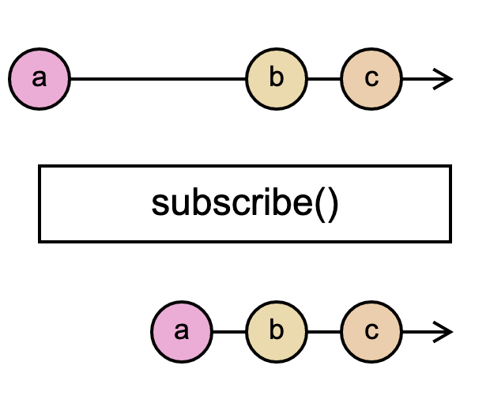

# `BehaviorSubject`

> A variant of Subject that requires an initial value and emits its current value whenever it is subscribed to.

<br/>



<!--code-snipet-start-->
```ts
import { BehaviorSubject } from "rxjs";

export const subject = new BehaviorSubject("a");

console.log("Initial value", subject.value);

subject.subscribe((val) => {
  console.log("Got value", val);
});

subject.next("b");
subject.next("c");

/*
Initial value a
Got value a
Got value b
Got value c
*/

```
<!--code-snipet-end-->

### Related

- [`Subject`](../Subject/)
- [`ReplaySubject`](../ReplaySubject/)


### Links

- [RxJS docs](https://rxjs.dev/api/index/class/BehaviorSubject)
- [learnrxjs.io](https://www.learnrxjs.io/learn-rxjs/subjects/behaviorsubject)