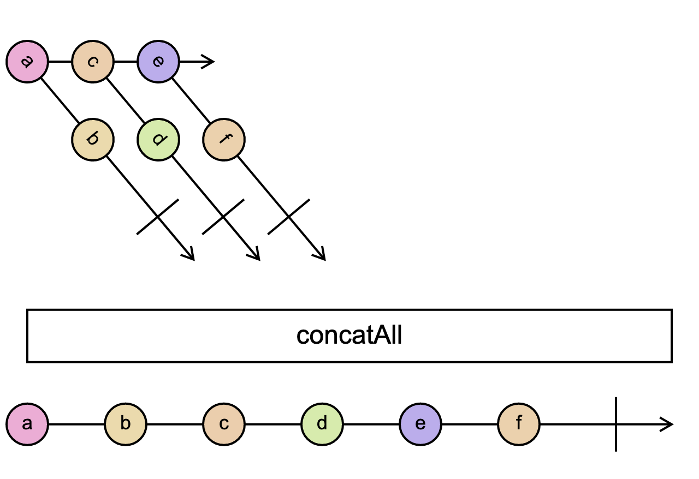

# `concatAll`

> Converts a higher-order Observable into a first-order Observable by concatenating the inner Observables in order.

<br/>



<!--code-snipet-start-->
```ts
import { concatAll, Observable } from "rxjs";

const inner1 = new Observable((subscriber) => {
  setTimeout(() => subscriber.next("a"));
  setTimeout(() => subscriber.next("b"), 100);
  setTimeout(() => subscriber.complete(), 200);
});

const inner2 = new Observable((subscriber) => {
  setTimeout(() => subscriber.next("c"));
  setTimeout(() => subscriber.next("d"), 100);
  setTimeout(() => subscriber.complete(), 200);
});

const inner3 = new Observable((subscriber) => {
  setTimeout(() => subscriber.next("e"));
  setTimeout(() => subscriber.next("f"), 100);
  setTimeout(() => subscriber.complete(), 200);
});

const outer = new Observable<Observable<any>>((subscriber) => {
  subscriber.next(inner1); // <--- We are emitting observables!
  subscriber.next(inner2);
  subscriber.next(inner3);
});

const concattedAll = outer.pipe(concatAll());

concattedAll.subscribe((value) => {
  console.log(value);
});

/*
a
b
c
d
e
f
*/

```
<!--code-snipet-end-->

### Related

- [`concat`](../concat/)
- [`concatMap`](../concatMap//)


### Links

- [RxJS docs](https://rxjs.dev/api/index/function/concatAll)
- [learnrxjs.io](https://www.learnrxjs.io/learn-rxjs/operators/combination/concatAll)