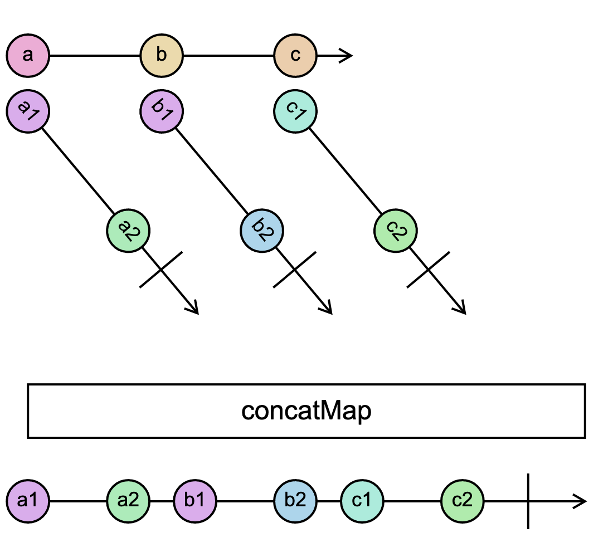

# `concatMap`

> Projects each source value to an Observable which is merged in the output Observable, in a serialized fashion waiting for each one to complete before merging the next.

<br/>



<!--code-snipet-start-->
```ts
import { concatMap, Observable } from "rxjs";

const source = new Observable<string>((subscriber) => {
  setTimeout(() => subscriber.next("a"), 0);
  setTimeout(() => subscriber.next("b"), 200);
  setTimeout(() => subscriber.next("c"), 400);
});

const concatMapped = source.pipe(
  concatMap(
    (letter) =>
      new Observable((subscriber) => {
        setTimeout(() => subscriber.next(letter + "1"), 0);
        setTimeout(() => subscriber.next(letter + "2"), 300);
        setTimeout(() => subscriber.complete(), 400);
      })
  )
);

concatMapped.subscribe((value) => {
  console.log(value);
});

/*
a1
a2
b1
b2
c1
c2
*/

```
<!--code-snipet-end-->

### Related

- [`concatAll`](../concatAll/)
- [`concat`](../concat)


### Links

- [RxJS docs](https://rxjs.dev/api/index/function/concatMap)