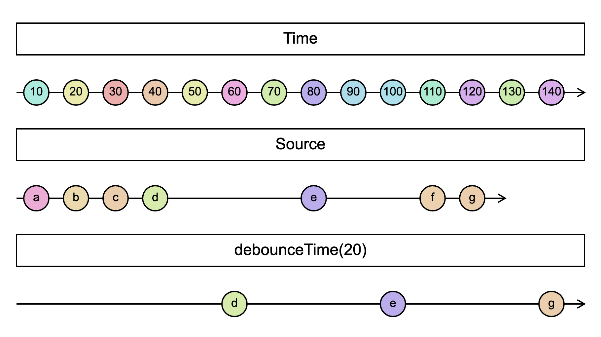

# `debounceTime`

> Emits a notification from the source Observable only after a particular time span has passed without another source emission.

<br/>



<!--code-snipet-start-->
```ts
import { debounceTime, Observable } from "rxjs";

const source = new Observable((subscriber) => {
  setTimeout(() => subscriber.next("a"), 10);
  setTimeout(() => subscriber.next("b"), 20);
  setTimeout(() => subscriber.next("c"), 30);
  setTimeout(() => subscriber.next("d"), 40);
  setTimeout(() => subscriber.next("e"), 80);
  setTimeout(() => subscriber.next("f"), 110);
  setTimeout(() => subscriber.next("g"), 120);
});

const debounced = source.pipe(debounceTime(20));

const time = new Date().getTime();
debounced.subscribe((value) => {
  console.log(value, new Date().getTime() - time);
});

/*
d 63
e 103
g 142
*/

```
<!--code-snipet-end-->

### Related

- [`throttleTime`](../throttleTime//)


### Links

- [RxJS docs](https://rxjs.dev/api/operators/debounceTime)
- [learnrxjs.io](https://www.learnrxjs.io/learn-rxjs/operators/filtering/debouncetime)