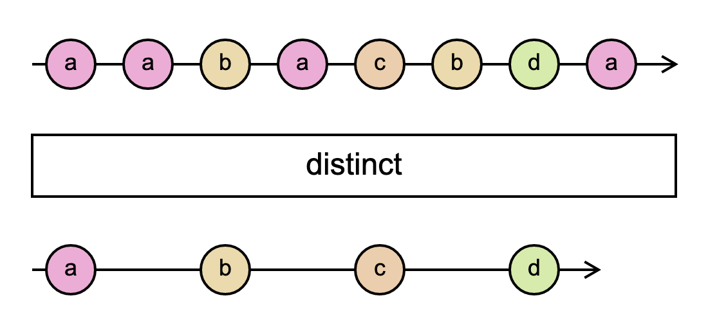

# `distinct`

> Returns an Observable that emits all items emitted by the source Observable that are distinct by comparison from previous items.

<br/>



<!--code-snipet-start-->
```ts
import { distinct, Observable } from "rxjs";

const source = new Observable((subscriber) => {
  subscriber.next("a");
  subscriber.next("a");
  subscriber.next("b");
  subscriber.next("a");
  subscriber.next("c");
  subscriber.next("b");
  subscriber.next("d");
  subscriber.next("a");
});

const distincted = source.pipe(distinct());

distincted.subscribe((value) => {
  console.log(value);
});

/*
a
b
c
d
*/

```
<!--code-snipet-end-->

### Related

- [`distinctUntilChanged`](../distinctUntilChanged/)


### Links

- [RxJS docs](hhttps://rxjs.dev/api/index/function/distinct)
- [learnrxjs.io](https://www.learnrxjs.io/learn-rxjs/operators/filtering/distinct)