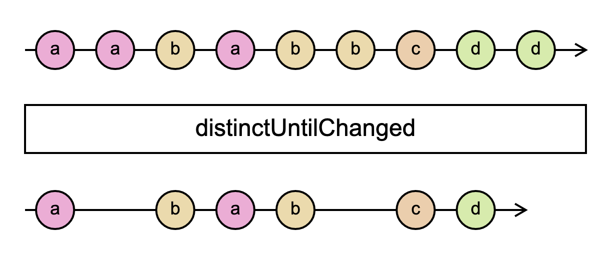

# `distinctUntilChanged`

> Returns a result Observable that emits all values pushed by the source observable if they are distinct in comparison to the last value the result observable emitted.

<br/>



<!--code-snipet-start-->
```ts
import { distinctUntilChanged, Observable } from "rxjs";

const source = new Observable((subscriber) => {
  subscriber.next("a");
  subscriber.next("a");
  subscriber.next("b");
  subscriber.next("a");
  subscriber.next("b");
  subscriber.next("b");
  subscriber.next("c");
  subscriber.next("d");
  subscriber.next("d");
});

const distinctedUntilChanged = source.pipe(distinctUntilChanged());

distinctedUntilChanged.subscribe((value) => {
  console.log(value);
});

/*
a
b
a
b
c
d
*/

```
<!--code-snipet-end-->

### Related

- [`distinct`](../distinct/)


### Links

- [RxJS docs](https://rxjs.dev/api/index/function/distinctUntilChanged)
- [learnrxjs.io](https://www.learnrxjs.io/learn-rxjs/operators/filtering/distinctuntilchanged)