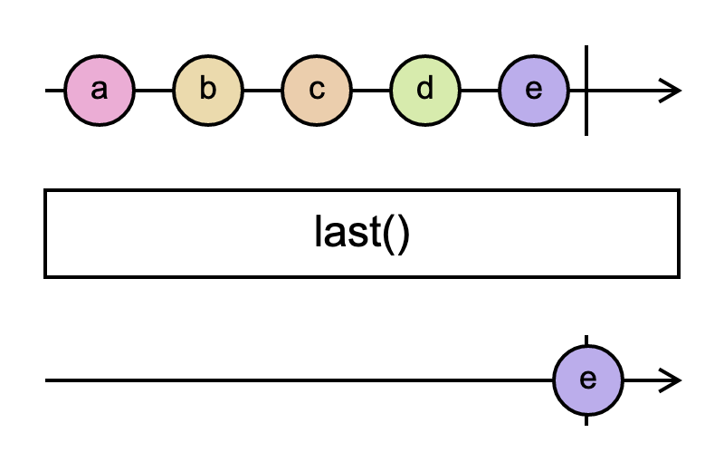

# `last`

> Returns an Observable that emits only the last item emitted by the source Observable. It optionally takes a predicate function as a parameter, in which case, rather than emitting the last item from the source Observable, the resulting Observable will emit the last item from the source Observable that satisfies the predicate.

<br/>



<!--code-snipet-start-->
```ts
import { last, Observable } from "rxjs";

const source = new Observable((subscriber) => {
  subscriber.next("a");
  subscriber.next("b");
  subscriber.next("c");
  subscriber.next("d");
  subscriber.next("e");
  subscriber.complete();
});

const lasted = source.pipe(last());

lasted.subscribe((value) => {
  console.log(value);
});

/*
e
*/

```
<!--code-snipet-end-->


### Links

- [RxJS docs](https://rxjs.dev/api/index/function/last)
- [learnrxjs.io](https://www.learnrxjs.io/learn-rxjs/operators/filtering/last)