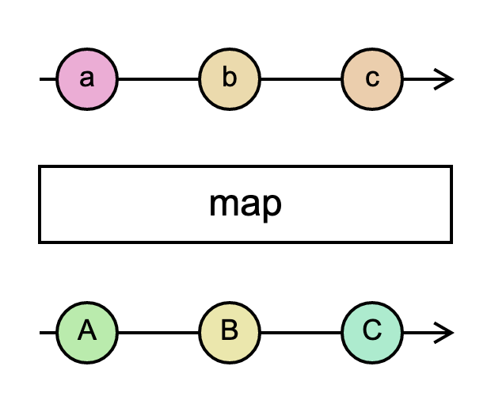

# `map`

> Applies a given `project` function to each value emitted by the source Observable, and emits the resulting values as an Observable.

<br/>



<!--code-snipet-start-->
```ts
import { map, Observable } from "rxjs";

const source = new Observable<string>((subscriber) => {
  setTimeout(() => subscriber.next("a"));
  setTimeout(() => subscriber.next("b"), 100);
  setTimeout(() => subscriber.next("c"), 200);
});

const mapped = source.pipe(map((value) => value.toUpperCase()));

mapped.subscribe((value) => {
  console.log(value);
});

/*
A
B
C
*/

```
<!--code-snipet-end-->


### Links

- [RxJS docs](https://rxjs.dev/api/index/function/map)
- [learnrxjs.io](https://www.learnrxjs.io/learn-rxjs/operators/transformation/map)