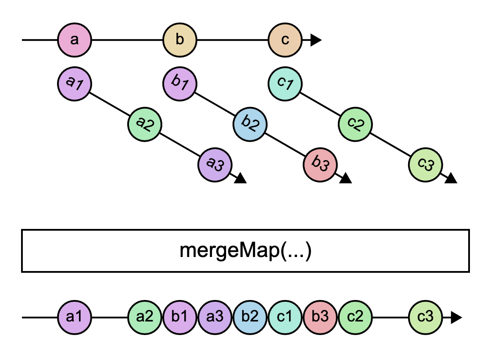

# `mergeMap`

> Projects each source value to an Observable which is merged in the output Observable.

<br/>



<!--code-snipet-start-->
```ts
import { mergeMap, Observable } from "rxjs";

const source = new Observable<string>((subscriber) => {
  setTimeout(() => subscriber.next("a"), 0);
  setTimeout(() => subscriber.next("b"), 400);
  setTimeout(() => subscriber.next("c"), 800);
});

const mergeMapped = source.pipe(
  mergeMap(
    (letter) =>
      new Observable((subscriber) => {
        setTimeout(() => subscriber.next(letter + "1"));
        setTimeout(() => subscriber.next(letter + "2"), 300);
        setTimeout(() => subscriber.next(letter + "3"), 600);
      })
  )
);

mergeMapped.subscribe((value) => {
  console.log(value);
});

/*
a1
a2
b1
a3
b2
c1
b3
c2
c3
*/

```
<!--code-snipet-end-->

### Related

- [`merge`](../merge/)


### Links

- [RxJS docs](https://rxjs.dev/api/index/function/mergeMap)
- [learnrxjs.io](https://www.learnrxjs.io/learn-rxjs/operators/transformation/mergemap)