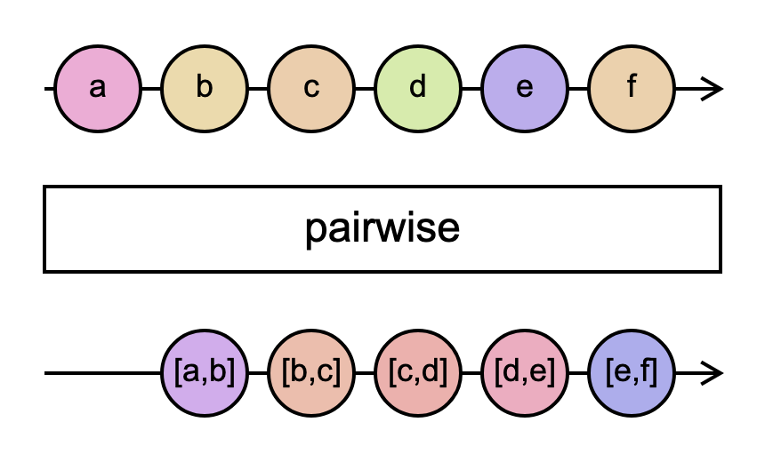

# `pairwise`

> Groups pairs of consecutive emissions together and emits them as an array of two values.

<br/>



<!--code-snipet-start-->
```ts
import { Observable, pairwise } from "rxjs";

const source = new Observable((subscriber) => {
  subscriber.next("a");
  subscriber.next("b");
  subscriber.next("c");
  subscriber.next("d");
  subscriber.next("e");
});

const pairwised = source.pipe(pairwise());

pairwised.subscribe((value) => {
  console.log(value);
});

/*
[ 'a', 'b' ]
[ 'b', 'c' ]
[ 'c', 'd' ]
[ 'd', 'e' ]
*/

```
<!--code-snipet-end-->

### Links

- [RxJS docs](https://rxjs.dev/api/index/function/pairwise)
- [learnrxjs.io](https://www.learnrxjs.io/learn-rxjs/operators/combination/pairwise)