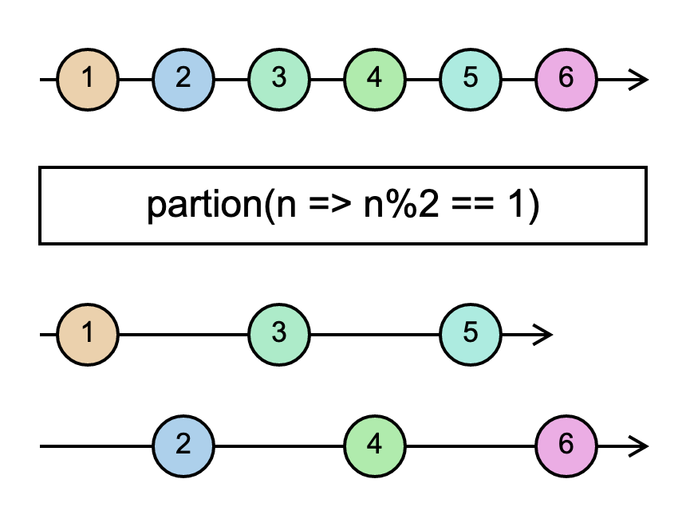

# `partition`

> Splits the source Observable into two, one with values that satisfy a predicate, and another with values that don't satisfy the predicate.

> It's like filter, but returns two Observables: one like the output of filter, and the other with values that did not pass the condition.

<br/>



<!--code-snipet-start-->
```ts
import { Observable, partition } from "rxjs";

const source = new Observable<number>((subscriber) => {
  setTimeout(() => subscriber.next(1), 100);
  setTimeout(() => subscriber.next(2), 200);
  setTimeout(() => subscriber.next(3), 300);
  setTimeout(() => subscriber.next(4), 400);
  setTimeout(() => subscriber.next(5), 500);
  setTimeout(() => subscriber.next(6), 600);
});

const [partion1, partion2] = partition(source, (num) => num % 2 == 1);

partion1.subscribe((value) => {
  console.log("p1:", value);
});

partion2.subscribe((value) => {
  console.log("p2:", value);
});

/*
p1: 1
p2: 2
p1: 3
p2: 4
p1: 5
p2: 6
*/

```
<!--code-snipet-end-->

### Related

- [`filter`](../filter/)


### Links

- [RxJS docs](https://rxjs.dev/api/index/function/partition)
- [learnrxjs.io](https://www.learnrxjs.io/learn-rxjs/operators/transformation/partition)