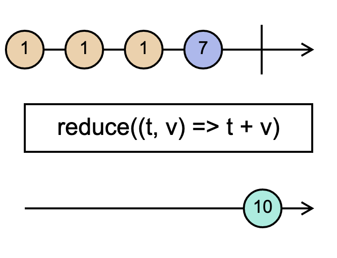

# `reduce`

> Applies an accumulator function over the source Observable, and returns the accumulated result when the source completes, given an optional seed value.

> Combines together all values emitted on the source, using an accumulator function that knows how to join a new source value into the accumulation from the past.

<br/>



<!--code-snipet-start-->
```ts
import { Observable, reduce } from "rxjs";

const source = new Observable<number>((subscriber) => {
  setTimeout(() => subscriber.next(1));
  setTimeout(() => subscriber.next(1), 100);
  setTimeout(() => subscriber.next(1), 200);
  setTimeout(() => subscriber.next(7), 300);
  setTimeout(() => subscriber.complete(), 400);
});

const reduced = source.pipe(reduce((total, value) => total + value, 0));

reduced.subscribe((value) => {
  console.log(value);
});

/*
10
*/

```
<!--code-snipet-end-->

### Related

- [`scan`](../scan/)


### Links

- [RxJS docs](hhttps://rxjs.dev/api/index/function/reduce)
- [learnrxjs.io](https://www.learnrxjs.io/learn-rxjs/operators/transformation/reduce)