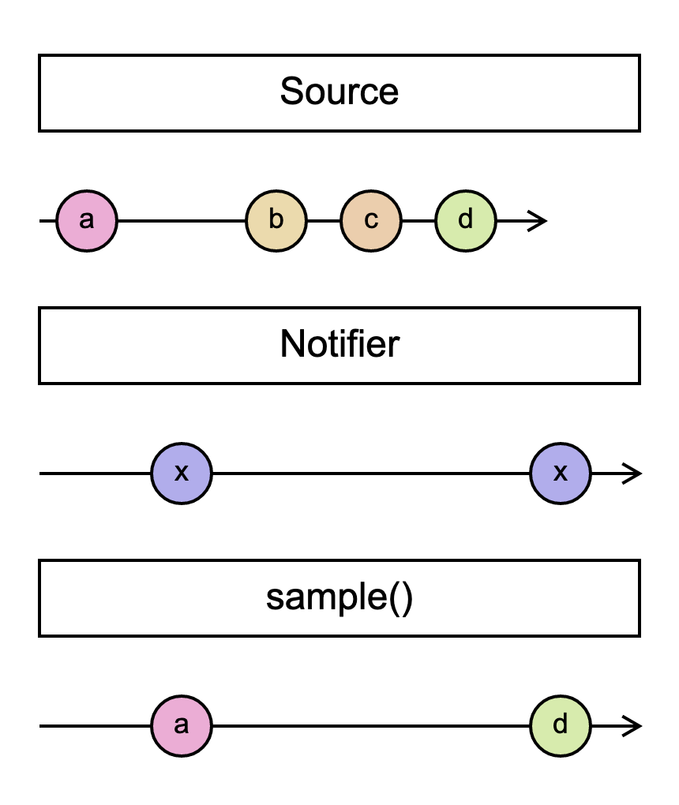

# `sample`

> Emits the most recently emitted value from the source Observable whenever another Observable, the notifier, emits.

> It's like `sampleTime`, but samples whenever the notifier Observable emits something.

<br/>



<!--code-snipet-start-->
```ts
import { Observable, sample } from "rxjs";

const source = new Observable((subscriber) => {
  setTimeout(() => subscriber.next("a"), 100);
  setTimeout(() => subscriber.next("b"), 300);
  setTimeout(() => subscriber.next("c"), 400);
  setTimeout(() => subscriber.next("d"), 500);
});

const notifier = new Observable((subscriber) => {
  setTimeout(() => subscriber.next("x"), 200);
  setTimeout(() => subscriber.next("x"), 500);
});

const sampled = source.pipe(sample(notifier));

sampled.subscribe((value) => {
  console.log(value);
});

/*
a
d
*/

```
<!--code-snipet-end-->


### Links

- [RxJS docs](https://rxjs.dev/api/index/function/sample)
- [learnrxjs.io](https://www.learnrxjs.io/learn-rxjs/operators/filtering/sample)