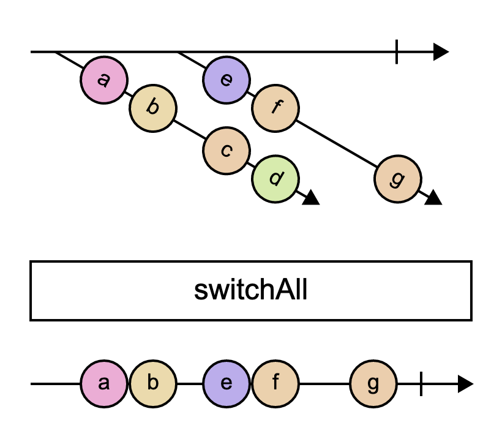

# `switchAll`

> Converts a higher-order Observable into a first-order Observable producing values only from the most recent observable sequence.

<br/>



<!--code-snipet-start-->
```ts
import { Observable, switchAll } from "rxjs";

const inner1 = new Observable((subscriber) => {
  setTimeout(() => subscriber.next("a"));
  setTimeout(() => subscriber.next("b"), 100);
  setTimeout(() => subscriber.next("c"), 300);
  setTimeout(() => subscriber.next("d"), 400);
});

const inner2 = new Observable((subscriber) => {
  setTimeout(() => subscriber.next("e"));
  setTimeout(() => subscriber.next("f"), 100);
  setTimeout(() => subscriber.next("g"), 400);
});

const outer = new Observable<any>((subscriber) => {
  setTimeout(() => subscriber.next(inner1)); // <--- We are emitting observables!
  setTimeout(() => subscriber.next(inner2), 200);
});

const switchedAll = outer.pipe(switchAll());

switchedAll.subscribe((value) => {
  console.log(value);
});

/*
a
b
e
f
g
*/

```
<!--code-snipet-end-->

### Related

- [`switchMap`](../switchMap/)

### Links

- [RxJS docs](https://rxjs.dev/api/index/function/switchAll)