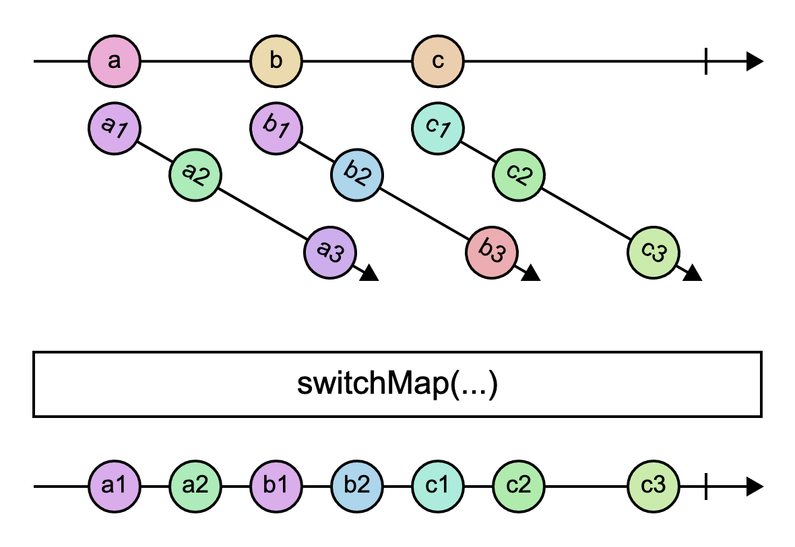

# `switchMap`

> Projects each source value to an Observable which is merged in the output Observable, emitting values only from the most recently projected Observable.

<br/>



<!--code-snipet-start-->
```ts
import { Observable, switchMap } from "rxjs";

const source = new Observable<string>((subscriber) => {
  setTimeout(() => subscriber.next("a"), 0);
  setTimeout(() => subscriber.next("b"), 400);
  setTimeout(() => subscriber.next("c"), 800);
});

const switchMapped = source.pipe(
  switchMap(
    (letter) =>
      new Observable((subscriber) => {
        setTimeout(() => subscriber.next(letter + "1"), 0);
        setTimeout(() => subscriber.next(letter + "2"), 100);
        setTimeout(() => subscriber.next(letter + "3"), 600);
      })
  )
);

switchMapped.subscribe((value) => {
  console.log(value);
});

/*
a1
a2
b1
b2
c1
c2
c3
*/

```
<!--code-snipet-end-->

### Related

- [`switchAll`](../switchAll/)

### Links

- [RxJS docs](https://rxjs.dev/api/index/function/switchMap)
- [learnrxjs.io](https://www.learnrxjs.io/learn-rxjs/operators/transformation/switchmap)