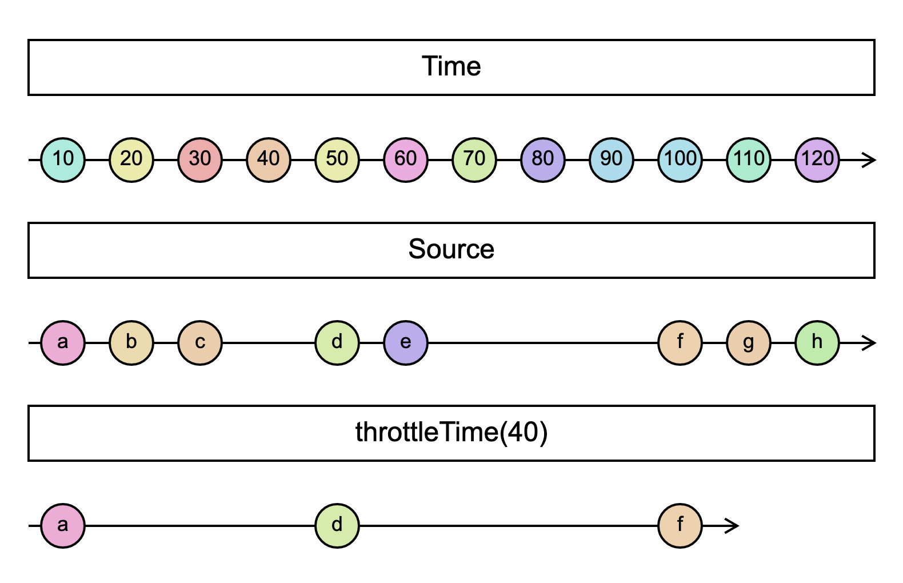

# `throttleTime`

> Emits a value from the source Observable, then ignores subsequent source values for duration milliseconds, then repeats this process.

<br/>



<!--code-snipet-start-->
```ts
import { Observable, throttleTime } from "rxjs";

const source = new Observable((subscriber) => {
  setTimeout(() => subscriber.next("a"), 10);
  setTimeout(() => subscriber.next("b"), 20);
  setTimeout(() => subscriber.next("c"), 30);
  setTimeout(() => subscriber.next("d"), 50);
  setTimeout(() => subscriber.next("e"), 60);
  setTimeout(() => subscriber.next("f"), 100);
  setTimeout(() => subscriber.next("g"), 110);
  setTimeout(() => subscriber.next("h"), 120);
});

const throttled = source.pipe(throttleTime(30));

const time = new Date().getTime();
throttled.subscribe((value) => {
  console.log(value, new Date().getTime() - time);
});

/*
a 11
d 51
f 100
*/

```
<!--code-snipet-end-->

### Related

- [`debounceTime`](../debounceTime/)

### Links

- [RxJS docs](hhttps://rxjs.dev/api/operators/throttleTime)
- [learnrxjs.io](https://www.learnrxjs.io/learn-rxjs/operators/filtering/throttletime)